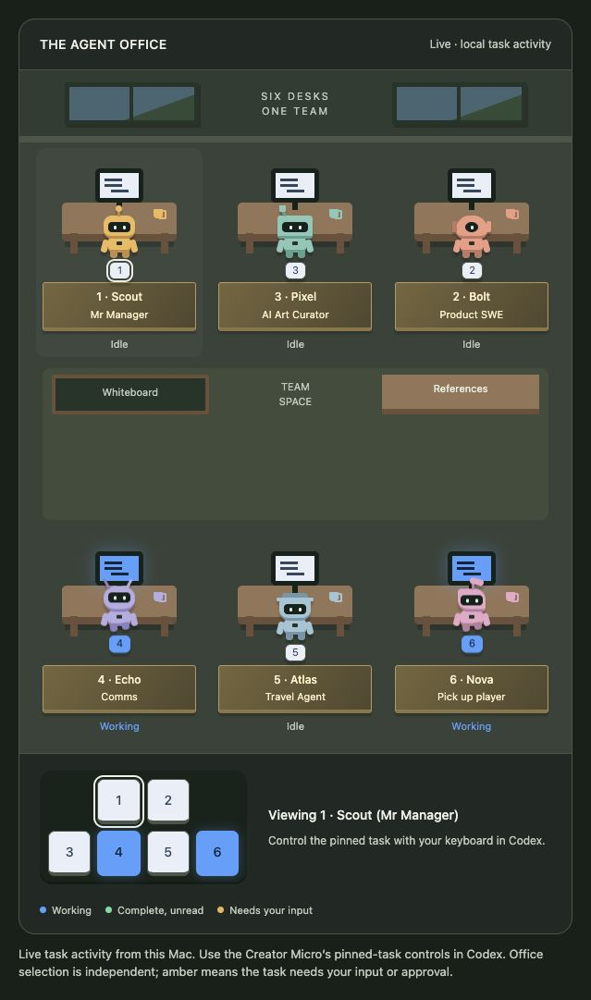

# Agent Office

**A live office for your Codex agents.**

Six pinned tasks become six characters with their own desks, nameplates, and activity colors. Working agents walk between their desks, the whiteboard, and the reference shelf. When a task needs your input or approval, its monitor, illustrated key, and character badge turn amber.

Agent Office is a local companion for the Codex desktop app on macOS. It pairs with the Creator Micro 2's built-in **Pinned chats** mapping and also works while you select tasks normally in Codex.



## Start the office

You need the Codex desktop app on the same Mac, Python 3.9 or newer, and a modern browser. The application uses Python's standard library; there are no packages to install.

```sh
git clone https://github.com/mcornelia/agent-office.git
cd agent-office
python3 server.py
```

Open **http://127.0.0.1:4318/** in your browser. Pin up to six local tasks in Codex and start working. The office updates about once a second.

On macOS, you can also double-click **Start Agent Office.command**. Stop the server with Control-C in its terminal.

For a different local Codex directory or port:

```sh
python3 server.py --codex-dir ~/.codex --port 4319
```

## Meet the team

Each task keeps its character when you reorder the pinned tasks. Rename a task to change its desk plaque. Put a role in parentheses to show it on the second line:

```text
Scout (Mr Manager)
Bolt (Product SWE)
Pixel (AI Art Curator)
Echo (Comms)
Atlas (Travel Agent)
Nova (Pick up player)
```

These are example names. The live office uses your current pinned task names. The illustrated keypad follows the physical arrangement: two keys above a row of four.

| Color | Meaning |
| --- | --- |
| White | Idle |
| Blue | Working |
| Amber | Waiting for your input or approval |
| Green | Complete, with an unread result |
| Red | Observed error |
| Dark | Status unavailable or no assigned task |

Movement illustrates activity; a walk to the whiteboard does not mean a particular tool is running. Reduced-motion preferences are respected.

## Use the Creator Micro 2

1. Enable the keyboard's native Codex layer and **Pinned chats** mapping.
2. Pin your tasks in the order you want for keys 1–6.
3. Keep Codex focused, press an agent's physical key, and give that task work.
4. Watch its character and activity colors update in the office.

The office's on-screen keys select a character for inspection. Task selection, prompting, and physical keyboard LEDs remain controlled by Codex. Native key selection is not mirrored into the office selection highlight.

## Give the office a manager

The optional manager workflow lets an existing task inspect teammates, coordinate routine next steps on already-authorized jobs, and report meaningful results, blockers, and decisions. The viewer and manager run independently.

See [manager setup](manager/README.md). Installing or running the viewer does not send prompts or create automations. Manager setup requires an explicit instruction in your chosen Codex task.

## Local data and compatibility

The server binds only to `127.0.0.1`. It rejects unexpected Host and Origin headers, has no write API, and does not serve arbitrary files. No analytics, external fonts, or cloud service is required by Agent Office.

It reads pinned-task metadata from a local SQLite database in read-only mode and observes local session events. A read-only subscription to Codex's local desktop status stream supplies working, approval-wait, and input-wait states. Only status fields are retained from stream snapshots; conversation text, commands, approval details, and tool output are never sent to the web page.

`identities.json` stores local task-to-character assignments. The manager's roster, brief, and job ledger are also local. These files are excluded from Git. The manager's optional message-reading helper runs separately and is never exposed through HTTP.

**Compatibility:** the local database, session files, and desktop status stream use observed internal formats. Codex updates may require an adapter change. This version was checked with the macOS desktop app in September 2026; it is not a supported public Codex status API. Windows, remote tasks, and ChatGPT cloud tasks are not currently supported.

If the desktop status stream is unavailable, active work shows as unavailable rather than guessing whether it is waiting for approval. Completed and idle session states can still be displayed. Keep the Mac and Codex running for live status and local manager checks.

## Development

The interface is plain HTML, CSS, and JavaScript. There is no frontend build dependency.

```sh
# Rebuild index.html from the scene and page shell.
python3 build_view.py

# Run the activity, status, and message-reader checks.
python3 -m unittest -v test_server.py test_desktop_status.py
python3 -m unittest discover -s manager -p 'test_*.py' -v

# Inspect your current six slots locally. Output contains private task IDs.
python3 server.py --check
```

| File | Purpose |
| --- | --- |
| `office.html` | Characters, desks, colors, and movement |
| `page-shell.html` | Browser page and local activity polling |
| `build_view.py` | Generates the committed `index.html` |
| `server.py` | Read-only local HTTP server and activity mapping |
| `desktop_status.py` | Local desktop status subscription |
| `manager/` | Optional coordination brief, configuration, and context reader |

The standalone `office.html` scene has an example activity preview for interface development. `index.html` always connects to the local activity source.

When reporting a compatibility issue, include your macOS, Python, and Codex versions and the visible symptom. Remove personal task names, IDs, paths, and conversation content from any shared diagnostic output.
